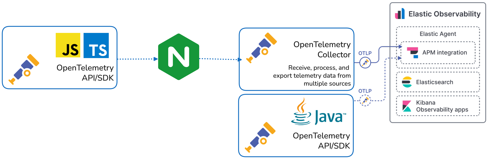
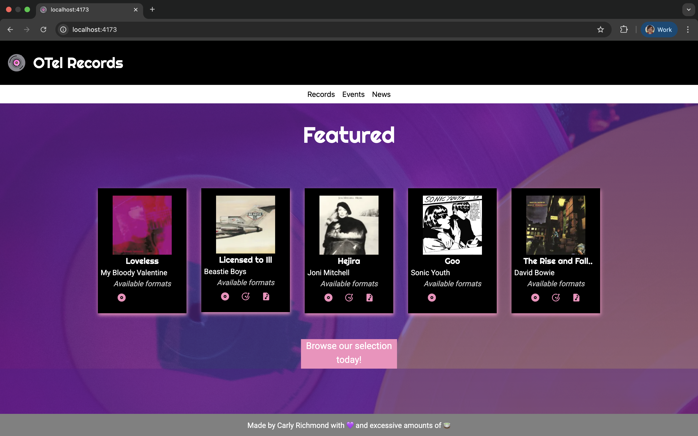
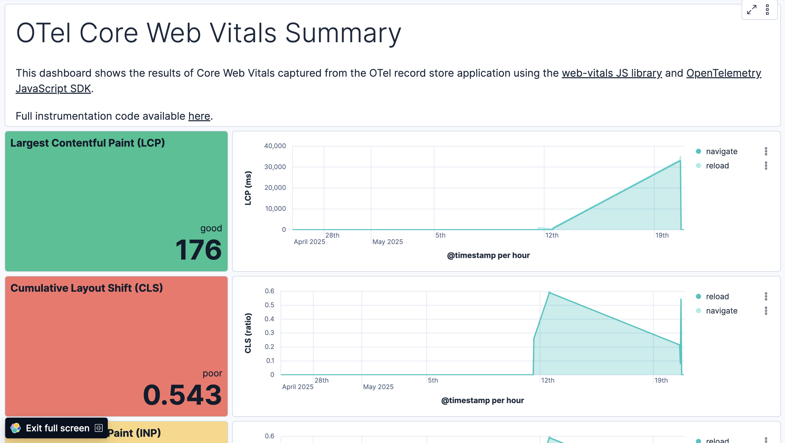

# OTEL Record Store

Example Web Application Using OTel Web Instrumentation for the browser:



## Local Setup

```zsh
git clone https://github.com/carlyrichmond/otel-record-store.git

# UI setup
cd records-ui
npm install
```

## Run

Following the below steps will make available the OTel Record store application at `http://localhost:4173`:



** Note: requires installation of [Docker](https://docs.docker.com/desktop/). **

```zsh
docker-compose build
docker-compose up
```

To generate sample data [Playwright](https://playwright.dev/) is also required:

```zsh
npx playwright install
```

To start the UI and generate sample telemetry data using the Playwright E2E tests, run the following command:

```zsh
cd records-ui
npm install
npm run generate
```

If you would like to generate your own events manually, simply run the `npm run dev` command to start the application locally on `http://localhost:4173`:

```zsh
cd records-ui
npm install
npm run generate
```

## Dashboard

The web vitals exported by the [custom web-vitals.instrumentation.ts](./records-ui/src/lib/telemetry/web-vitals.instrumentation.ts) can be visualized in a Kibana dashboard, similar to the below:



If you would like to import and try to use this dashboard, please use the exported NDJSON file [core-web-vitals-dashboard-export.ndjson](./dashboards/core-web-vitals-dashboard-export.ndjson).

## Attributions

1. Vinyl icon created by [Freepik](https://www.flaticon.com/free-icons/vinyl) on Flaticon.
2. Available format SVG icons sourced from [Iconify](https://icon-sets.iconify.design/).
3. Record album covers sourced via [Rolling Stones: The 100 Best Album Covers of All Time](https://www.rollingstone.com/music/music-lists/best-album-covers-1235035232/)
